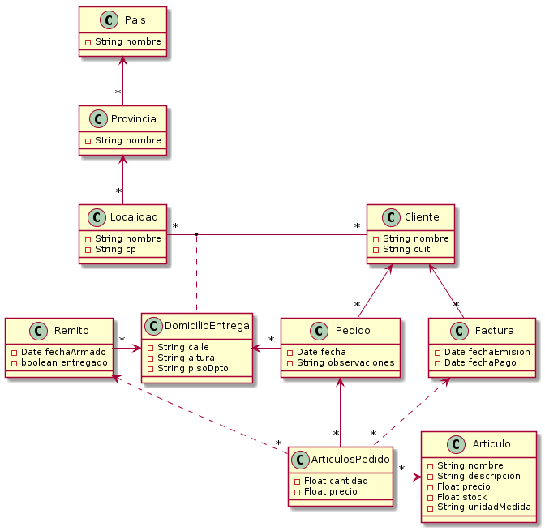

### Laboratorio de Programación y lenguajes
### Trabajo Práctico

# Delivery
### Pedido, entrega y facturación de Artículos.

Para la instalación y configuración del entorno de desarrollo es necesario seguir el siguiente 
<a href="https://git.fi.mdn.unp.edu.ar/labprog/core/infraestructura-tps/-/blob/master/README.md" target="_blank">INSTRUCTIVO</a>

---

## Problema planteado
La empresa de logística “Lo llevamos a tu casa” se dedica a recibir pedidos telefónicos de sus clientes (que deben estar previamente registrados) para luego entregar los artículos solicitados en las locaciones indicadas por los mismos.
Una vez que se recepcionan los productos, la empresa procede a la facturación de los mismos.

## Objetivo de solución
Desarrollar una aplicación basada en el modelo de datos adjunto donde:
Cada pedido de artículos para el cliente, indica una sola localización de entrega.
Si se requieren varias localizaciones de entrega se deben confeccionar varios pedidos.
También pueden existir múltiples pedidos para el mismo cliente y la misma localización.
Los pedidos se valorizan para referencia del cliente y aunque no haya stock (existencia) de un artículo, el mismo mantiene el precio indicado al cliente.
El pedido se realiza independientemente de la existencia de stock o no del mismo.
Los remitos para entregar la mercadería se confeccionan automáticamente en función de los artículos pedidos y el stock (existencia) de los mismos.
Las Cantidades solicitadas siempre se entregan completas, no admitiendo entregas parciales.
Se deberá confeccionar un remito para cada locación del cliente indicada.
Una vez que a los artículos de un remito se les confirma su recepción por parte de los destinatarios.
Se procede a procesar (automáticamente) la confección de la factura, valorizando la misma.

## La solución requiere
### ABMC (Altas, bajas, modificaciones y consultas) de las siguientes entidades.
* Países, provincias y localidades
* Clientes y domicilios de entrega.
* Artículos.

### Confección de nuevo pedido a un cliente existente.
Indica localización de entrega del mismo, los artículos, las cantidades solicitadas y la valorización del pedido.

### Búsqueda y Consulta de un pedido de un cliente.
Consulta del histórico de artículos pedidos de un cliente, indicando si el mismo fue entregado y facturado y en qué fechas.
Del listado se deberá poder visualizar todo el pedido a partir de un artículo.

### Proceso de confección de remitos.
En base a todos los artículos pedidos y que no hayan sido procesados se deben confeccionar remitos por cliente y locación de entrega con todos los artículos que se puedan entregar en función del stock (existencia) del mismo.
En caso de no poder entregar todo el material, dicho artículo no será incluido en el remito.
Cada asignación de artículos a un pedido, deberá garantizar la actualización del stock (existencia) remanente.

### Búsqueda y Consulta de remitos de un cliente.
Se deberá poder navegar a los pedidos que lo conforman.
 Deberá estar ordenada por fecha de armado (fecha de confección) de forma descendente.
Se deberá poder filtrar la lista de remitos por su estado, entregados o no (pendiente de recepción).

### Verificación de artículos entregados.
Se deberá poder consultar todos los artículos no confirmados (en la recepción), independientemente del remito o cliente (ordenados por localización de entrega) y poder verificar (chequear) que el mismo fue entregado (proceso de confirmación de entrega: manual).

### Proceso de confección de facturas (automático).
Para todos los artículos recepcionados y que no hayan sido facturados, de deberá emitir una factura por cada cliente (independientemente de su domicilio de entrega).

### Búsqueda y Consulta de facturas de un cliente.
Se deberá poder navegar a los remitos que la conforman. Deberá estar ordenada por fecha de emisión (fecha de confección) de forma descendente.
Se deberá poder filtrar la lista de facturas por si fueron pagadas o no (pendiente de pago).

### Verificación de facturas pagadas.
Se deberá poder consultar todas las facturas que no han sido pagadas aún y poder verificar (chequear) que la misma se abonó y en que fecha (básicamente lo importante es la fecha de pago).

## Criterio de satisfacción

### Ejemplo de uso y validaciones
La aplicación deberá garantizar la implementación de los casos de uso descriptos anteriormente.
La verificación de calidad se realizará utilizando las siguientes premisas para un conjunto de pruebas a realizar:
* Cargar múltiples pedidos para múltiples clientes. Donde existan al menos dos localizaciones diferentes para al menos 2 de los clientes que realizan pedidos.
Cargar al menos 2 pedidos diferentes a la misma locación para el mismo cliente.
* Los artículos cargados en los pedidos deberán garantizar:
  * Al menos un artículo que tenga stock (existencia) necesario para todos los pedidos realizados. Dicho artículo deberá estar en al menos 3 pedidos distintos.
  * Al menos un artículo que se pueda entregar parcialmente. Al menos 2 remitos que se puedan conformar y al menos dos que no.
  * Corolario de lo anterior será comprobar que si bien en el proceso de conformación de remito no hay existencia para el remito que se está procesando, se pueda asignar stock para algún remito siguiente a conformar en el mismo proceso.
  Por ejemplo:
    1. *Artículo A* posé un stock de 10 unidades al comenzar el proceso.
    1. *Remito 1* para el *Cliente X* solicita 6 unidades del artículo, se le asignan y por lo tanto queda un stock de 4 unidades para el *Artículo A*.
    1. *Remito 2* para el *Cliente Y* solicita 7 unidades del *Artículo A* y por lo tanto, por falta de existencia no se le agrega el artículo al remito.
    1. *Remito 3* del *Cliente Z* solicita 3 unidades del *Artículo A* y por lo tanto como el stock es de 4 unidades, se le asignan las 3 solicitadas y se conforma el artículo en el remito, quedando 1 unidad de stock para el artículo.
  * La confección de facturas deberá contar con al menos 2 remitos no entregados.
  * Todos los reportes solicitados deberán mostrar todas las opciones de combinaciones posibles.

Todos los casos de criterios de satisfacción deberán estar correctamente documentados y deberán poder ser replicado y repetidos pasos a paso en la devolución a realizar con el docente.

La presentación de defensa con el docente deberá ser una presentación de la solución, donde el alumno demuestre paso a paso todos los casos de prueba y criterios de satisfacción solicitados.

